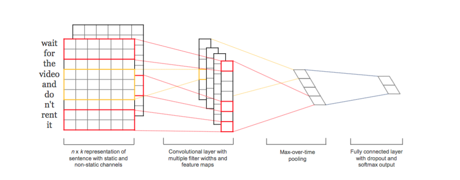
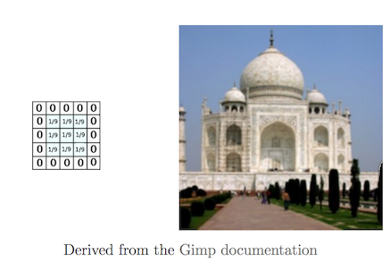
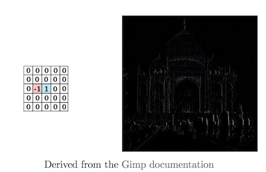

# CNN-based Text Classification

This is an implementation of Yoon Kim's ["Convolutional Neural Networks for Sentence Classification"](https://arxiv.org/pdf/1408.5882.pdf) (2014).



Image source: Kim (2014).

## Contents

- [Jupyter Notebook](#Notebook)
- [Code](#Code)
- [Example Usage](#Usage)
- [Motivation](#Motivation)
- [CNNs](#CNNs)
- [Model Specifics](#Model-Specifics)
- [Features](#Features)
- [References](#References)
- [Citation](#Citation)
- [License](#License)


## Notebook

Check out the Jupyter notebook [here](text_cnn.ipynb) to run the code.

## Code

You can find the implementation [here](../../models/text_cnn.py) with detailed comments. 
This model is fairly simple, but requires thinking about CNN filter dimensions.
I attempted to explain what to expect at each step.

## Usage

Train the model in a few lines of code:

```python

args = Namespace(
        # Model hyper-parameters
        max_sequence_length=582,
        dim_model=128, # Embedding size
        num_filters=128, # output filters from convolution
        window_sizes=[3,5,7], # different filter sizes, total number of filters len(window_sizes)*num_filters
        num_classes=2, # binary classification problem
        dropout=0.5, # 0.5 from original implementation, kind of high compared to other papers (usually 0.1)
        # Training hyper-parameters
        num_epochs=5,
        learning_rate=1.e-6, #chosing LR is important, often accompanied with scheduler to change
        batch_size=32
)


train_loader, vocab = text_cnn_dataset.TextCNNDataset.get_training_dataloader(args)
model = text_cnn.TextCNN(vocab_size = len(vocab),
                        dim_model = args.dim_model,
                        num_filters = args.num_filters,
                        window_sizes =  args.window_sizes,
                        num_classes = args.num_classes,
                        dropout = args.dropout)

trainer = train.TextCNNTrainer(args, vocab.mask_index, model, train_loader, vocab)
trainer.run()
```

## Motivation

The prevailing architecture found in most classic ML approaches to NLP classification is to take a series of
heuristically defined features (such as the bag-of-word (BoW) approaches like TF-IDF) and to
try to train a model/estimator to combine those features. In effect, you can think of those features
as "weak", independent predictors that a model is combining into a stronger prediction.

Let's say you have a "null" model built in this fashion. The question is: *How can one improve upon this?*

In general, the best starting place is to examine feature engineering and transforms (the 2 terms are often interchangeably
used).

Feature engineering/extraction would be to find new methods of engineering the raw inputs to be more
amenable to modeling. Feature transforms would constitute taking those features and creating further down-stream features
of those features, say either making a feature possess a bell-curve distribution (if structured field) or even a non-shallow model approach.

In terms of feature engineering/ representations, a break through in this regard was employing unsupervised training to derive semantic [embeddings](../word2vec/README.md) as features 
(link is to implementation of Skipgram).
Many paper results have shown a significant improvement in model performance when using these pre-trained representations. It's
surprising to see that one could input these into a linear model and outperform TF-IDF in many situations. One downside of using embeddings
in a linear model is that you need to pool across the embeddings in order to collapse the dimensionality, so a max/average pooling technique
is often required.

Following this logical thread, is there a way to take these embeddings and extract further information from them?
*How can we get at automated feature extraction?*

This is where deep learning, and in particular, convolutional neural networks (CNNs) come into play.

## CNNs

### The Convolution Operation




"Blurry convolution"



"Dark-mode convolution"

Image sources: Chris Colah's article on [CNNs](http://colah.github.io/posts/2014-07-Understanding-Convolutions/).

Convolution is a well-known mathematical operation of applying a filter on a set of inputs. Here above, you can see static/fixed
convolution filters applied to the pixels of a picture of the Taj Mahal. One is blurring the image while the other is inverting
the colors. 

Convolution filters and pooling layers form the bedrock of the CNN architecture. 
These are neural network architectures that *derive* the values of a series of convolution filters 
in order to extract useful features from a series of inputs. 

### Advantages of CNNs

Convolution layers have many advantages in that one can vary 
the number of filters simultaneously running over a set of inputs, as well as the properties such as:
(1) *size of the filters* (i.e. the window size of the filter as it moves over the set of inputs); (2) *the stride or pace
of the filters* (i.e. if it skips over the volume of inputs ); etc. One benefit of using convolution layers is that they
may be stacked on top of each other in a series of layers. *Each layer of convolution filters is thought to derive a different
level of feature extraction*, from the most rudimentary at the deepest levels to the finer details at the shallowest levels.
Pooling layers are interspersed between convolution layers in order to summarize (i.e. reduce the dimensionality of) 
the information from a set of feature maps via sub-sampling.

A final note is that CNNs are typically considered very fast to train compared to other typical deep 
architectures (like say the RNN) as they process things in a simultaneous manner.

### CNNs Work Well for Classification/Identification/Detection

Both pooling and convolution operations are **locally invariant**, which means that their ability to detect a feature
is independent of the location in the set of inputs. This lends itself very well to classification tasks. 

## Model-Specifics


Image source: Denny Britz's blog post [here](http://www.wildml.com/2015/11/understanding-convolutional-neural-networks-for-nlp/).

### Overview

The over-arching goal of Kim's CNN model is to make sentence-level predictions of user sentiment based on movie review 
(he looks at 2 different datasets).

To achieve this, the model is setup with the following set of layers:

1. *Embeddings*: Words in a sentence are converted to embeddings. Kim tries pre-trained embeddings versus embeddings
that are derived in the model and found, as one might expect, that the pre-trained embedding model outperformed the other model
(see embeddings post [here](../word2vec/README.md) and the GPT (language model) post [here](../gpt/README.md) to get a review of
transfer learning).
2. *Convolution Layers*: These embeddings are then fed into a series of convolution layers of different filter sizes
to extract features from the embeddings. Note that these filters run along the sentence length, but consider the entire embedding length.
Each convolution layer output is fed into a RELU activation function.
3. *Pooling Layers*: The convolution filters are then sub-sampled via max-pooling and aggregated for a final layer
that is put through a dense transform.

The model output is then trained to minimize the usual cross-entropy loss function.

### Departures from the Original Paper

A few ways in which I (as well as most implementations I've seen) depart from the original paper:

1. I don't load pre-trained embeddings, but instead derived them in the model training.
2. I don't use an L2 norm on the weights.

## Features

- [ ] CNN feature extraction of word embeddings.
- [ ] Torchtext::IMDB dataset usage


## References

These implementations were helpful:
1. https://github.com/yoonkim/CNN_sentence (Yoon Kim's original implementation in Theanos)
2. https://github.com/dennybritz/cnn-text-classification-tf (Denny Britz's implementation in Tensorflow)
3. https://github.com/Shawn1993/cnn-text-classification-pytorch (This implementation was well-organized)


In terms of explaining the intuition of the model, I thought these were well-written:
1. Original paper (link found above)
2. http://colah.github.io/posts/2014-07-Understanding-Convolutions/ (Chris Colah's blog post on CNNs)
2. http://www.wildml.com/2015/11/understanding-convolutional-neural-networks-for-nlp/ (Denny Britz's blog post on CNNs for NLP)

## Citation

```python
@misc{CNN-based Text Classification,
  author = {Thompson, Will},
  url = {https://github.com/will-thompson-k/deeplearning-nlp-models},
  year = {2020}
}
```
## License

MIT
