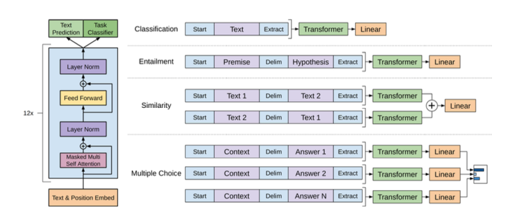
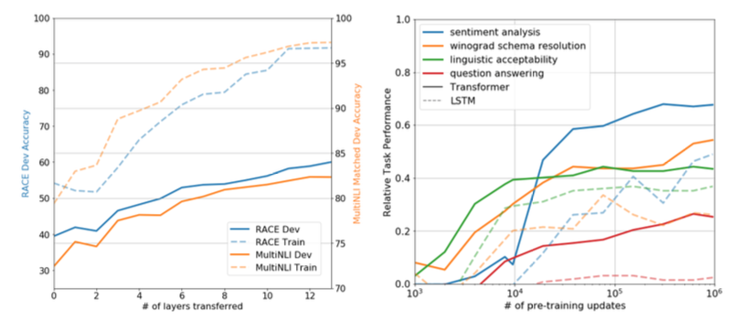

# GPT: Unsupervised Pre-training & the Decoder-only Transformer

This is the implementation of OpenAI's style of Transformer, the "Generative Pre-training" (i.e. GPT) model, which has 3 generations:
1) <ins>GPT-1</ins>: Radford et al. ["Improving Language Understanding by Generative Pre-Training"](https://cdn.openai.com/research-covers/language-unsupervised/language_understanding_paper.pdf) (2018).
2) <ins>GPT-2</ins>: Radford et al. ["Language Models are Unsupervised Multitask Learners"](https://cdn.openai.com/better-language-models/language_models_are_unsupervised_multitask_learners.pdf) (2019).
3) <ins>GPT-3</ins>: Brown et al. ["Language Models are Few-Shot Learners"](https://arxiv.org/pdf/2005.14165.pdf) (2020).



Image source: Radford et al. (2018)

## Contents

- [Jupyter Notebook](#Notebook)
- [Code](#Code)
- [Example Usage](#Usage)
- [GPT Motivation](#GPT)
- [GPT Model Specifics](#GPT-Model-Details)
- [Features](#Features)
- [References](#References)
- [Citation](#Citation)
- [License](#License)


## Notebook

Check out the Jupyter notebook [here](gpt.ipynb) to run the code.

## Code

You can find the implementation [here](../../models/gpt.py) with detailed comments. 
This model is nearly identical to the original Transformer [here](../../models/gpt.py), 
except that it is only a decoder.

## Usage

Train the model in a few lines of code:

```python


args = Namespace(
        # Model hyper-parameters
        num_layers_per_stack=2,  # original value = 12
        dim_model=12, #original value = 768
        dim_ffn=48, # original value = 3072
        num_heads=2, # original value = 12
        block_size=64, # original value = 512, context window
        dropout=0.1,
        # Training hyper-parameters
        num_epochs=1, #obviously super short
        learning_rate=0.0,
        batch_size=32, #original value = 64
    )

train_loader, vocab = gpt_dataset.GPTDataset.get_training_dataloader(args)
model = gpt.GPT(vocab_size = len(vocab),
            num_layers_per_stack= args.num_layers_per_stack,
            dim_model = args.dim_model,
            dim_ffn = args.dim_ffn,
            num_heads = args.num_heads,
            block_size = args.block_size,
            dropout = args.dropout)
trainer = train.GPTTrainer(args,vocab.mask_index,model,train_loader,vocab)
trainer.run()
```

## GPT

GPT, which stands for "Generative Pre-trained Transformer", is a part of the realm of "sequence models" (sequence-to-sequence or "seq2seq"),
models that attempt to map an input (source) sequence and map it to an output (target) sequence. 
Sequence models encompass a wide range of representations, from long-standing, classical probabilistic approaches such as
Hidden Markov Models (HMMs), Bayesian networks, et.c to more recent "deep learning" models such as recurrent neural networks (RNNs).

GPT belongs to a newer the class of models known as Transformers, which we touch upon [here](../transformer/README.md).

### GPT is a Language Model Transformer

Unlike the original Transformer which is originally posed as a Machine Translation model
(i.e. translate one sequence into another sequence), the GPT is a Language Model (LM). LMs ask the natural question:
given a sequence of words, what is most likely to follow? Put mathematically, LMs are concerned with predicting
the next term(s) in a sequence conditional on all the previous points in the sequence:
```python
p(u_i|u_i-1,u_i-2,...,u_i-block_size)
```
In this sense, LMs are -auto-regressive- models.
 
To fit the Transformer architecture to an LM problem, we can take the encoder-decoder architecture of the OG Transformer
and discard the encoder. The decoder, you will notice, inherently is concerned with predicting the next item in a sequence
using some previous number of items of the sequence (i.e. context window or "block size").

### Language Models are the Ultimate Transfer Learners

The authors observe that deep learning in NLP requires substantial amounts of 
manually-labeled data, which it makes it hard to be applicable everywhere. They see the solution in transfer learning,
where a model can be largely trained ("pre-trained") on a very large dataset and subsequently fine-tuned to a 
smaller problem. 

But how does one accomplish this pre-training? Their answer: through unsupervised (really, self-supervised) learning. 
Pre-trained word embeddings had been prior the most compelling evidence of unsupervised learning's 
ability to help learn useful things (see notes on word2vec embeddings [here](../word2vec/README.md)). 
Motivated by this, they hypothesized LMs as the ultimate self-supervised models that could ultimately be applied as 
transfer learners. 

### The GPT Approach

Using their own decoder Transformer architecture, they establish a "semi-supervised" approach using a combination 
of un-supervised pre-training and supervised fine-tuning. 

The goal of this is to learn a universal representation 
that transfers with little adaptation to a wider range of tasks, and therefore is an extension of transfer learning.

### Step 1: Self-supervised objective

The first step is to train the LM to a very large corpus of text. 


Image source: Radford et al. (2018)

By training the model to predict the next word in
a sequence, the hypothesis is that it will be able to transfer what it has learned to other problems.

### Step 2: Fine-tuning objective

After pre-training the LM, the next step is to apply it to be tuned to a specific set of tasks with their
associated labels. The loss is the usual loss function; however, they also introduce a tunable amount of further
un-supervised learning as well.


Image source: Radford et al. (2018)

### Results

As elaborated on in their first paper, they found that the GPT model was able to successfully be fine-tuned
in a number of auxiliary tasks.



Image source: Radford et al. (2018)

## GPT-Model-Details

Here are some small notes from the each paper. I highly recommend you take a crack at reading them further better
information.

### GPT-1

Most of the above was written based on GPT-1 observations.
Here are some other notes:

* pre-training: 
- on BooksCorpus dataset. Didn't like Word Benchmark because it
shuffled sentences, breaking up dependencies.
* 12-layer decoder-only transformer.
- dim_model = 768
- num_heads = 12 (of self-attention model)
- Optimization:
- Max learning rate of 2.5e-4
- 2000 updates linear increase, annealed to 0 using Cosine Scheduler
(Note: I stuck with NoamOptimizer to make life simple)
- Weight initialization of N(0,0.02)
- BPE with 40k merges (Note: stuck with usual word-encoding)
- Activation functions used were GELU instead of RELU
- Learned positions instead of original fixed Sinusoidal
- Spacy tokenizer (Note: I used pre-built torchtext)
* fine-tuning:
- Same hyper-parameters as pre-training + drop-out.
- Found 3 epochs of training was sufficient.

### GPT-2

tl;dr GPT-1 with larger pre-training and **multi-task learning**.

The largest model achieves SOTA on 7/8 benchmarks in zero-shot (i.e, no fine-tuning) setting.

The goal is still to move towards a general model that can perform many tasks. 
The authors' observation is that the prevalance of single task training hinders 
the model's ability to generalize further. Thus, they introduce multi-tasking learning, where 
the training data consists of a heterogenous mixture of tasks, i.e:
the language model went from learning:
```python
p(output|input)
```

to

```python
p(output|input,context)
```

This is an extension of transfer learning. Prior to this change, the concept of **task conditioning** was handled on
an architectural level. However, the authors theorized that LMs were 
flexible enough to handle this. 

Here is a list of some model specifics that changed since GPT-1:
* layer normalized move to input of each sub-block
* normalization added after self-attention block
* context size went from 512 to 1024 tokens, batch_size of 512.

### GPT-3

This paper I'm still working through. The model is now at 175B parameters with
96 layers, 96 heads, and dim_model = 12,288. I gather than the
attention mechanism is different. 

## Features

- [ ] Self-contained "library" of GPT model re-implementation, tokenizer, 
dictionary, data loader, and re-producible notebook example
- [ ] Re-using existing transformer code to adapt to the GPT problem
- [ ] Torchtext dataset usage


## References

These implementations were helpful:
1. https://github.com/karpathy/minGPT (Kaparthy's "minimal" implementation of GPT. Super-well written)
2. https://github.com/openai/gpt-2 (Original GPT-2 code, tensorflow)


In terms of explaining the intuition of the model, I thought these were well-written:
1. Original paper (link found above)
2. https://github.com/karpathy/minGPT (Kaparthy's comments are worth a ready, especially in his example notebooks.)


## Citation

```python
@misc{GPT: Unsupervised Pre-training & the Decoder-only Transformer,
  author = {Thompson, Will},
  url = {https://github.com/will-thompson-k/deeplearning-nlp-models},
  year = {2020}
}
```
## License

MIT
