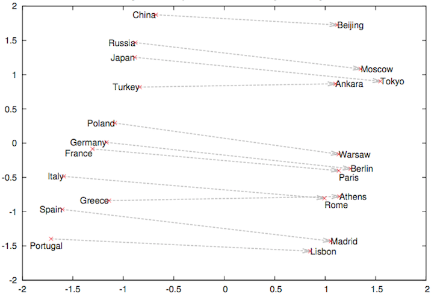

# Word2vec: Skip-gram Implementation

This is the implementation of the Skip-gram model in the paper:  <br> &nbsp;&nbsp;&nbsp;&nbsp;
Mikolov et al. ["Distributed Representations of Words and Phrases
    and their Compositionality"](https://papers.nips.cc/paper/5021-distributed-representations-of-words-and-phrases-and-their-compositionality.pdf) 2013. 



(note: all images are from paper)
## Contents

- [Jupyter Notebook](#Notebook)
- [Example Usage](#Usage)
- [Motivation of Using Embeddings](#Motivation)
- [Skip-gram](#Skip-gram)
    * [Negative Sampling](#Negative_Sampling)
- [Features](#Features)
- [References](#References)
- [Citation](#Citation)
- [License](#License)

## Notebook

Check out the Jupyter notebook [here](word2vec.ipynb) to see how to run the code!


## Usage

Transform a corpus and train the model is a few lines of code:

```python
args = Namespace(
    # skip gram data hyper-parameters
    context_window_size = 5, # window around target word for defining context
    subsample_t = 10.e-15, # param for sub-sampling frequent words
    # Model hyper-parameters
    embedding_size = 300, # size of embeddings
    negative_sample_size= 20, # k examples to be used in negative sampling loss function
    # Training hyper-parameters
    num_epochs=100,
    learning_rate=0.0001,
    batch_size = 4096,
)


train_dataloader, vocab = SkipGramDataset.get_training_dataloader(args.context_window_size,
                                                                args.subsample_t,
                                                                args.batch_size)
word_frequencies = torch.from_numpy(vocab.get_word_frequencies())
model = word2vec.SkipGramNSModel(len(vocab), args.embedding_size, args.negative_sample_size,word_frequencies)
trainer = train.Word2VecTrainer(args,model,train_dataloader)
trainer.run()
embeddings = model.get_embeddings()
```

## Motivation

A traditional **bag-of-words** (i.e. "BOW") approach extracts heuristic-defined features from a given text.
These are often **frequency-based**, where the frequency of a term is thought to be proportional to its signal.
We know this hypothesis isn't totally accurate - for instance, the word "the" may appear very frequently, but
lack any meaningful value- so massaging through pre-processing and/or frequency transformations is usually required 
to tweak terms. These "independent" features are then sub-selected and combined as weak predictors to developer a 
stronger composite prediction about some target.

Suppose that we were interested in boosting our model's signal by gaining contextual understanding of the words in a text.
This is the premise of the **"distribution hypothesis"**, that words that are close in proximity in a sentence share meaning. 
Word embeddings present a representation that gets closer to semantic meaning than a purely frequency-based approach.

Embeddings are one of the most frequent forms of **"transfer learning"** found in NLP. Taking some set of documents (preferably very,very large), 
word embeddings are trained to express the context of words found together within this corpus in a lower dimensional encoding 
(lower with respect to the vocabulary, which can be on the order of ~10-100k's). While it is usually hard to interpret the 
meaning of these latent variables, they can be "transferred" to many other downstream NLP tasks (usually with fewer data points).

While there are many popular embeddings, word2vec is one of the most popular class of embedding models.

## Skip-gram

With the word2vec style of embedding problem, there are 2 arguments: an input/target word and a 
collection of surrounding words (i.e "context").

One style of word2vec tries to map multiple the context to a given target ("CBOW", or continuous bag of words). 
The other style, "skip-gram" attempts to take an input word and map it to a context. This implementation is
concerned with the latter.


### Negative_Sampling

The canonical skip-gram problem is here:


where each of those probabilities are calculated by a softmax probability calculation.

However, this approach suffers from being *extremely* slow as the denominator needs to be calculated for each word
in the vocabulary.

This paper by Mikolov et al. proposed a novel way of getting around this computational hurdle. Instead of
framing the problem as a multi-class classification problem, it treated it as a *k+1* set of binary classification problems.
For each positive (input,context) example, there are k random negative samples drawn to train the model.


This paper includes a number of other insights to speed up computation, including sub-sampling frequent words.

## Features

This implementation contains the following from the paper:
- [ ] frequent word sub-sampling
- [ ] negative sampling 

## References

These implementations were helpful:
1. https://github.com/Andras7/word2vec-pytorch
2. https://github.com/theeluwin/pytorch-sgns

I thought this high-level explanation of skip-grams was well-written: https://kelvinniu.com/posts/word2vec-and-negative-sampling/.

For a more thorough review of embeddings and their properties, Chris Colah's piece https://colah.github.io/posts/2014-07-NLP-RNNs-Representations/
is a fantastic read.

## Citation

```python
@misc{Word2vec: Skip-gram Implementation,
  author = {Thompson, Will},
  url = {https://github.com/will-thompson-k/deeplearning-nlp-models},
  year = {2020}
}
```
## License

MIT


